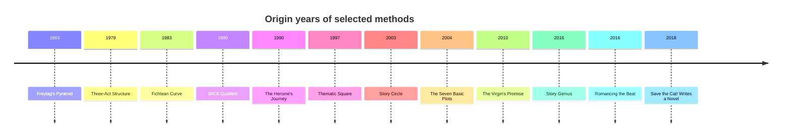
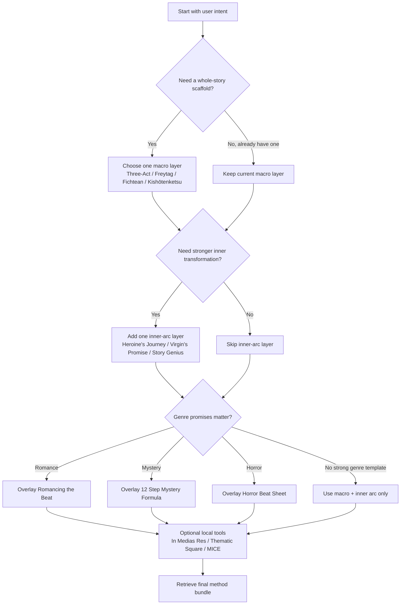
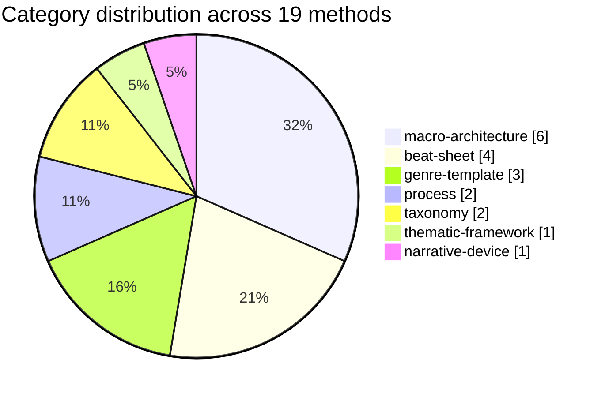

# RAG-ready JSONL Dataset Design for Nineteen Plot-Structure Methods

## Executive summary

The most robust way to convert the comparative analysis of these nineteen plot methods into a retrieval-ready corpus is to treat **one method as one canonical record**, keep the schema flat and stable, and reserve `beats` for ordered sequences only when a method genuinely has a named progression. That matters because the source set is heterogeneous: some methods are broad plot architectures, some are explicit beat sheets, some are authoring processes, and some are taxonomies or thematic tools rather than narrative sequences. citeturn12view1turn16view0turn16view2turn34view0turn22view0turn11search0turn18view1turn12view4turn14view3turn12view10turn12view11turn31view0

Where possible, the dataset below anchors authorship and dates to official or near-official pages linked to entity["people","Syd Field","screenwriting teacher"], entity["people","Dan Harmon","tv writer"], entity["people","Jessica Brody","novelist writing coach"], entity["people","Dan Wells","novelist writing teacher"], entity["people","Randy Ingermanson","novelist writing teacher"], entity["people","Orson Scott Card","science fiction author"], entity["people","Maureen Murdock","jungian author"], entity["people","Kim Hudson","story structure author"], entity["people","Gwen Hayes","romance author"], entity["people","Lisa Cron","story coach author"], entity["people","Robert McKee","screenwriting teacher"], and entity["people","Christopher Booker","journalist author"]. For older, diffuse, traditional, or loosely documented methods such as Kishōtenketsu, the Fichtean Curve, Freytag’s Pyramid, and Thematic Square, the populated file deliberately falls back to high-quality academic or craft explanations and explains that choice in `provenance_note`. citeturn12view1turn12view0turn14view3turn12view3turn7search5turn7search11turn11search0turn22view0turn32search11turn14view2

Two conservative rules drive the completed example file. First, `origin_year` is set to `null` when the online record is too diffuse to support a stable dating decision. Second, `beats` is left empty for records that are fundamentally classificatory or conceptual rather than sequential, such as MICE, Thematic Square, Seven Basic Plots, and In medias res. That is the safer choice for downstream retrieval and avoids over-claiming about canonical step order. citeturn9search3turn14view2turn31view0turn12view11

## Recommended schema

The schema below is optimised for JSONL, embedding pipelines, and metadata filtering. It is intentionally flat, because flattened records are easier to validate, index, and use inside hybrid retrieval systems than deeply nested craft ontologies.

| Field | Type | Required | Description |
|---|---|---:|---|
| `id` | string | yes | Stable ASCII slug, lowercase, hyphen-separated. Primary key for joins, chunks, and vector metadata. |
| `name` | string | yes | Canonical display name of the method. |
| `category` | string enum | yes | High-level family of method. |
| `short_summary` | string | yes | One or two sentence description of what the method does. |
| `beats` | array of strings | yes | Ordered named stages or steps. Empty array if the method is not sequential. |
| `typical_pacing_percentages` | object or `null` | yes | Percent ranges where the source explicitly supports a pacing map; otherwise `null`. |
| `focus` | array of string enums | yes | One or more of `external`, `internal`, `thematic`. |
| `granularity` | string enum | yes | `macro`, `meso`, or `micro`, depending on how locally the method operates. |
| `recommended_use_cases` | array of strings | yes | Controlled-vocabulary usage contexts. |
| `canonical_tags` | array of strings | yes | Search-friendly normalised tags. |
| `primary_source` | string URL | yes | Preferred official or primary URL; if unavailable, best high-quality secondary URL. |
| `secondary_sources` | array of string URLs | yes | Supporting sources, deduplicated, ideally one to three entries. |
| `authors` | array of strings | yes | Normalised creator names; allows organisations or traditional labels where no single author exists. |
| `origin_year` | integer or `null` | yes | Year of codification, publication, or first public teaching if defensible; otherwise `null`. |
| `provenance_note` | string | yes | One paragraph explaining source choice, fallback logic, and confidence. |

### Mapping rules from the comparative report

| Report element | Dataset field | Rule |
|---|---|---|
| Method name in the comparative report | `name` | Preserve widely recognised display form. |
| Method family in the report headings | `category` | Map to the controlled vocabulary below. |
| One-paragraph analysis of what the method is for | `short_summary` | Compress to one or two sentences; keep purpose, not examples. |
| Named acts, beats, steps, or phases | `beats` | Use canonical order from the best source. If the online record is incomplete or the method is not inherently sequential, use a representative minimal list or `[]` and explain why in `provenance_note`. |
| Any explicit percentage or quarter/half wording | `typical_pacing_percentages` | Convert to ranges like `[start,end]`; if only page counts are given, normalise to percentages; if not explicit, set `null`. |
| Analysis of whether the method emphasises outer plot, inner change, or theme | `focus` | Encode as an array using the `focus` vocabulary. |
| How zoomed-in the method is | `granularity` | `macro` for whole-story architecture, `meso` for beats or blueprinting, `micro` for local techniques such as openings. |
| “Best for” guidance | `recommended_use_cases` | Use only controlled vocabulary labels. |
| Search keywords and stylistic descriptors | `canonical_tags` | Use lower_snake_case tags. |
| Evidence hierarchy | `primary_source`, `secondary_sources`, `provenance_note` | Prefer official author/publisher pages, then lectures, then academic or reputable craft sources. |
| Attributed creator | `authors` | Use full names; if no individual creator is appropriate, use a stable organisational or traditional label. |
| Date of codification/publication | `origin_year` | Use only if defensible from the source set; else `null`. |

## Controlled vocabularies

These are the recommended controlled values for normalisation and filtering.

### Category

| Value | Meaning |
|---|---|
| `macro-architecture` | Whole-story structural skeletons. |
| `beat-sheet` | Explicit ordered beats for outlining or pacing. |
| `genre-template` | Genre-specific beat or plotting templates. |
| `process` | Writing workflows or design methods rather than plot shapes. |
| `taxonomy` | Classification systems for story types. |
| `thematic-framework` | Theme-mapping tools rather than plot paths. |
| `narrative-device` | Local narrative techniques rather than full architectures. |

### Focus

`focus` is an array using one or more of:

| Value | Meaning |
|---|---|
| `external` | Plot events, obstacles, reversals, confrontations. |
| `internal` | Character psychology, identity, wound, transformation. |
| `thematic` | Value systems, worldview conflict, thematic argument. |

### Granularity

| Value | Meaning |
|---|---|
| `macro` | Whole-story scaffold. |
| `meso` | Beat, sequence, or chapter-block planning. |
| `micro` | Scene-level or opening-level technique. |

### Recommended use cases

Recommended controlled values:

`novel`, `screenplay`, `tv`, `short_story`, `revision`, `teaching`, `discovery`, `detailed_outlining`, `pacing_control`, `character_arc`, `theme_design`, `romance`, `mystery`, `horror`, `conflict_light`, `nonlinear_opening`, `taxonomy_reference`, `series_planning`, `genre_blending`

### Canonical tags

Recommended tag pool:

`act_based`, `archetypal`, `beat_sheet`, `brain_science`, `chapter_level`, `character_arc`, `clue_management`, `commercial_fiction`, `conflict_driven`, `crisis_driven`, `detailed_outline`, `east_asian`, `fear_escalation`, `five_act`, `four_part`, `genre_template`, `healing`, `hook_first`, `identity`, `inner_arc`, `iterative_design`, `mystery`, `mythic`, `non_conflict`, `nonlinear`, `novel_planning`, `opening_technique`, `pacing`, `plot_diagnostics`, `plot_types`, `power_of_three`, `process_driven`, `quadrants`, `relationship_arc`, `rising_action`, `romance`, `scene_planning`, `screenwriting`, `self_fulfilment`, `start_end_logic`, `story_type`, `structural_classic`, `suspense`, `taxonomy`, `theme`, `thematic_argument`, `three_act_variant`, `tragedy`, `twist_reconciliation`, `value_polarity`, `worldbuilding`

### Provenance normalisation

| Field | Rule |
|---|---|
| `authors` | Use full display names in source order. For organisations use a stable label such as `Plottr editorial team`. For traditional forms use a neutral conventional label such as `traditional Chinese rhetoric`. |
| `primary_source` | Prefer official author site, official publisher page, official lecture/video, or public-domain book page. If none is suitable, use the most reliable method-specific secondary source. |
| `secondary_sources` | Deduplicate, strip tracking parameters, prefer English-language pages, prefer sources that directly illuminate definitions, beats, or dates. |
| `origin_year` | Choose the year of the method’s best-supported codification, publication, or public teaching, not a loosely inferred precursor date. |
| `provenance_note` | Always explain confidence level and any fallback from official to secondary sources. |

## Mapping and normalisation rules

### Beats

Normalise beats as an **ordered array of short, display-safe labels**.

Use these rules:

- Preserve source order.
- Use title casing or source casing consistently within a record.
- Avoid adding explanatory brackets unless they are part of the name users commonly search for.
- If a method is not inherently sequential, use `[]`.
- If the method is sequential but online naming varies, use a **representative minimal list** and state that explicitly in `provenance_note`.
- Do not force every method into fifteen or twelve or eight beats simply for schema symmetry.

### Authors

Use `authors` as a normalised array.

- Person names should be full names.
- One record may have one person, many people, an organisational author, or a traditional label.
- Do not split pseudonymous house or editorial authors into guessed individuals.
- If a method is traditional rather than singly authored, preserve that fact instead of inventing a founder.

### Citations and source preference

For dataset construction, prefer sources in this order:

1. Official author page or official publisher page.
2. Official lecture, course, or creator-owned resource.
3. Public-domain or bibliographic book page.
4. Academic source.
5. Reputable craft site.

Use the first source as `primary_source`. Put the rest in `secondary_sources`. If the best available evidence is secondary, say so directly in `provenance_note`.

## Example JSONL file

The populated file below follows the schema above and uses official or near-official sources where possible, with academic or reputable craft fallbacks for older, traditional, or weakly documented methods. Publication years, creator attributions, and public beat names are drawn from the source set cited in this report, especially the official pages for Three-Act, Save the Cat!, Snowflake, Story Genius, Romancing the Beat, The Virgin’s Promise, and The Heroine’s Journey, plus strong secondary explainers for Seven-Point, Fichtean Curve, Kishōtenketsu, 27-Chapter, Thematic Square, and Seven Basic Plots. citeturn12view1turn34view0turn14view5turn14view3turn12view3turn26view1turn24view1turn16view2turn32search11turn22view0turn18view1turn14view2turn31view0

```json
{"id":"three-act-structure","name":"Three-Act Structure","category":"macro-architecture","short_summary":"A broad beginning-middle-end scaffold, commonly codified in modern screenwriting as Setup, Confrontation, and Resolution. It works best as a high-level architecture rather than a micro-beat template.","beats":["Setup","Confrontation","Resolution"],"typical_pacing_percentages":{"act_1":[0,25],"act_2":[25,75],"act_3":[75,100]},"focus":["external"],"granularity":"macro","recommended_use_cases":["novel","screenplay","revision","teaching","pacing_control"],"canonical_tags":["act_based","structural_classic","screenwriting","novel_planning","conflict_driven"],"primary_source":"https://sydfield.com/guest-blog/utilizing-syd-fields-screenwriting-paradigm-to-understand-script-timeline-structureby-natalia-lazarus/","secondary_sources":["https://sydfield.com/paradigm.pdf","https://www.arcstudiopro.com/blog/three-act-structure-in-screenwriting"],"authors":["Syd Field"],"origin_year":1979,"provenance_note":"Primary source is Syd Field's official site, which explicitly credits the Paradigm to Screenplay (1979); the companion worksheet supports the familiar page-based 25/50/25 split. Confidence is high for the modern Fieldian codification, but this record intentionally treats earlier classical three-part precedents as background rather than the canonical online source."}
{"id":"story-circle","name":"Dan Harmon's Story Circle","category":"beat-sheet","short_summary":"An eight-step circular model that maps desire, descent, return, and change in a compact form. It is especially useful when the writer wants structure to track both outer action and inner transformation.","beats":["A character is in a zone of comfort","But they want something","They enter an unfamiliar situation","Adapt to it","Get what they wanted","Pay a heavy price for it","Return to their familiar situation","Having changed"],"typical_pacing_percentages":null,"focus":["external","internal"],"granularity":"meso","recommended_use_cases":["novel","screenplay","tv","character_arc","teaching"],"canonical_tags":["beat_sheet","character_arc","mythic","inner_arc","screenwriting"],"primary_source":"https://channel101.fandom.com/wiki/Story_Structure_101%3A_Super_Basic_Shit","secondary_sources":["https://www.studiobinder.com/blog/dan-harmon-story-circle/","https://reedsy.com/blog/guide/story-structure/dan-harmon-story-circle/"],"authors":["Dan Harmon"],"origin_year":2003,"provenance_note":"The clearest accessible source is a widely cited Channel 101 mirror of Harmon's original 'Story Structure 101' post, which lists the eight steps and attributes the piece to Harmon. Confidence is medium-high on the step order and medium on the year, which is normalised to 2003 from mirrored timestamp evidence rather than a currently hosted original Channel 101 page."}
{"id":"save-the-cat-writes-a-novel","name":"Save the Cat! Writes a Novel","category":"beat-sheet","short_summary":"Jessica Brody's novel-writing adaptation of the Save the Cat approach turns a story into fifteen named beats with explicit pacing targets. It is highly prescriptive and particularly strong for writers who want pacing control and revision diagnostics.","beats":["Opening Image","Theme Stated","Setup","Catalyst","Debate","Break Into 2","B Story","Fun and Games","Midpoint","Bad Guys Close In","All Is Lost","Dark Night of the Soul","Break Into 3","Finale","Final Image"],"typical_pacing_percentages":{"opening_image":[0,1],"theme_stated":[5,5],"setup":[1,10],"catalyst":[10,10],"debate":[10,20],"break_into_2":[20,20],"b_story":[22,22],"fun_and_games":[20,50],"midpoint":[50,50],"bad_guys_close_in":[50,75],"all_is_lost":[75,75],"dark_night_of_the_soul":[75,80],"break_into_3":[80,80],"finale":[80,99],"final_image":[99,100]},"focus":["external","internal"],"granularity":"meso","recommended_use_cases":["novel","revision","detailed_outlining","pacing_control","teaching"],"canonical_tags":["beat_sheet","pacing","character_arc","novel_planning","commercial_fiction"],"primary_source":"https://www.jessicabrody.com/books/non-fiction/save-cat-writes-novel/about/","secondary_sources":["https://www.jessicabrody.com/2020/11/how-to-write-your-novel-using-the-save-the-cat-beat-sheet/","https://www.amazon.com/Save-Cat-Writes-Novel-Writing/dp/0399579745"],"authors":["Jessica Brody"],"origin_year":2018,"provenance_note":"Primary source is Brody's official book page, and the beat names plus their percentage placements come from her own Save the Cat beat-sheet article. Confidence is high on author, year, beat order, and pacing because the public source set is unusually explicit for this method."}
{"id":"seven-point-story-structure","name":"7-Point Story Structure","category":"beat-sheet","short_summary":"A seven-node plotting system popularised by Dan Wells that emphasises turning points rather than dense beat-by-beat prescription. It is useful when a writer wants a strong skeleton without adopting a more detailed commercial beat sheet.","beats":["Hook","Plot Turn I","Pinch I","Midpoint","Pinch II","Plot Turn II","Resolution"],"typical_pacing_percentages":null,"focus":["external","internal"],"granularity":"meso","recommended_use_cases":["novel","screenplay","revision","detailed_outlining","character_arc"],"canonical_tags":["beat_sheet","plot_diagnostics","turning_points","novel_planning","screenwriting"],"primary_source":"https://www.youtube.com/playlist?list=PLzfRuHa21NIzQFrQ6FAq8Pj2IA_SXiwrN","secondary_sources":["https://writingexcuses.com/writing-excuses-7-41-seven-point-story-structure/","https://www.campfirewriting.com/learn/seven-point-story-structure"],"authors":["Dan Wells"],"origin_year":2010,"provenance_note":"Primary source is Wells's lecture series, supported by Writing Excuses and later craft summaries that preserve the same seven labels. Confidence is medium because online sources disagree on whether 2010 or 2013 best marks public popularisation; this record uses 2010, tied to the conference lecture cycle, and notes that the framework itself descends from role-playing-game structure."}
{"id":"fichtean-curve","name":"Fichtean Curve","category":"macro-architecture","short_summary":"A crisis-driven model that de-emphasises long setup and instead builds tension through a chain of mounting complications. Its strength is momentum: the story is repeatedly destabilised until it reaches a late climactic crest.","beats":["Inciting crisis","Escalating crises","Climax","Falling action"],"typical_pacing_percentages":null,"focus":["external"],"granularity":"macro","recommended_use_cases":["novel","screenplay","mystery","horror","pacing_control"],"canonical_tags":["crisis_driven","rising_action","conflict_driven","pacing","suspense"],"primary_source":"https://plottr.com/fichtean-curve-plot-structure/","secondary_sources":["https://www.penguinrandomhouse.com/books/58230/the-art-of-fiction-by-john-gardner/","https://reedsy.com/blog/guide/story-structure/fichtean-curve/"],"authors":["John Gardner"],"origin_year":1983,"provenance_note":"No stable official John Gardner web page explaining the named curve was surfaced, so the record uses a reputable craft explainer as the practical source and anchors origin_year to Gardner's 1983 The Art of Fiction. Confidence is medium-high on authorship and date, but lower on any rigid beat list because the curve is intentionally flexible and crisis-centric."}
{"id":"kishotenketsu","name":"Kishōtenketsu","category":"macro-architecture","short_summary":"A four-part East Asian structure built from introduction, development, twist, and conclusion, often discussed as a model that does not require conflict to function. It is especially valuable for thematic juxtaposition, gentle revelation, and comparison-based storytelling.","beats":["Ki","Sho","Ten","Ketsu"],"typical_pacing_percentages":{"ki":[0,25],"sho":[25,50],"ten":[50,75],"ketsu":[75,100]},"focus":["thematic","external"],"granularity":"macro","recommended_use_cases":["novel","short_story","teaching","theme_design","conflict_light"],"canonical_tags":["four_part","non_conflict","twist_reconciliation","east_asian","theme"],"primary_source":"https://slcc.pressbooks.pub/literarystudiesatslcc/chapter/east-asian-story-structure/","secondary_sources":["https://mythicscribes.com/plot/kishotenketsu/","https://lucianosalerno.com/kishotenketsu-the-four-act-structure"],"authors":["traditional Chinese rhetoric","traditional Japanese rhetoric"],"origin_year":null,"provenance_note":"Kishōtenketsu is a traditional East Asian rhetorical form rather than a singly authored modern manual, so origin_year is null and creators are normalised as traditions rather than individuals. Confidence is high on the four-part labels and on the claim that conflict is not structurally required, because both academic and reputable craft sources agree on those points."}
{"id":"freytags-pyramid","name":"Freytag’s Pyramid","category":"macro-architecture","short_summary":"A five-part dramatic model classically associated with exposition, rising action, climax, falling action, and resolution. Although often taught as a universal structure today, it originated as a theory of drama and tragedy.","beats":["Exposition","Rising Action","Climax","Falling Action","Resolution"],"typical_pacing_percentages":null,"focus":["external"],"granularity":"macro","recommended_use_cases":["novel","screenplay","teaching","revision"],"canonical_tags":["five_act","tragedy","structural_classic","conflict_driven","drama"],"primary_source":"https://books.google.com/books/about/Freytag_s_Technique_of_the_Drama.html?id=WhUzAQAAMAAJ","secondary_sources":["https://archive.org/download/freytagstechniqu00freyuoft/freytagstechniqu00freyuoft.pdf","https://catalog.hathitrust.org/Record/001011189"],"authors":["Gustav Freytag"],"origin_year":1863,"provenance_note":"Primary bibliographic sources tie the model to Freytag's Die Technik des Dramas, written in 1863 and later translated as Freytag's Technique of the Drama. Confidence is high on creator and year, and medium-high on the now-standard five-part wording because modern pedagogy slightly anglicises and standardises the labels."}
{"id":"twenty-seven-chapter-method","name":"27-Chapter Method","category":"beat-sheet","short_summary":"A highly granular story-planning framework that expands three acts into nine blocks and twenty-seven chapter-sized beats. It is useful for writers who want chapter-level planning without losing an overall act structure.","beats":["Introduction","Inciting Incident","Immediate Fallout","Reaction","Action","Consequence","Pressure","Plot Twist","Push","The New World","Fun and Games","Old World Juxtaposition","Build-Up","Midpoint","Reversal","Reaction","Trials","Dedication","The Calm Before the Storm","Plot Twist","Darkest Moment","The Power Within","Action","Converge","The Final Battle","The Climax","The Resolution"],"typical_pacing_percentages":{"act_1":[0,33],"act_2":[33,67],"act_3":[67,100]},"focus":["external","internal"],"granularity":"meso","recommended_use_cases":["novel","detailed_outlining","revision","character_arc","series_planning"],"canonical_tags":["detailed_outline","three_act_variant","power_of_three","novel_planning","chapter_level"],"primary_source":"https://www.youtube.com/watch?v=Y3wua1KWRVI","secondary_sources":["https://bookstr.com/how-to-write-your-novel-using-the-27-chapter-method/","https://artofnarrative.com/2023/06/21/how-to-use-the-27-chapter-plot-structure/"],"authors":["Kat O'Keefe"],"origin_year":null,"provenance_note":"Creator attribution to Kat O'Keefe is well supported by multiple summaries pointing back to her videos, but a stable official article and an exact first-publication year were not recovered from the accessible source set, so origin_year is null. Confidence is medium-high on the 3-act/9-block/27-chapter framing and medium on exact beat wording, which is sometimes paraphrased by secondary explainers."}
{"id":"snowflake-method","name":"The Snowflake Method","category":"process","short_summary":"An iterative design workflow that starts with a tiny story description and repeatedly expands it into characters, synopsis material, scene plans, and then draft pages. It is less a plot shape than a disciplined expansion process for building one.","beats":["One-sentence summary","One-paragraph summary","Character sheets","Expanded synopsis","Scene list","Draft"],"typical_pacing_percentages":null,"focus":["external","internal"],"granularity":"meso","recommended_use_cases":["novel","discovery","detailed_outlining","revision"],"canonical_tags":["iterative_design","top_down","scene_planning","character_work","process_driven"],"primary_source":"https://www.advancedfictionwriting.com/articles/snowflake-method/","secondary_sources":["https://www.advancedfictionwriting.com/","https://jerichowriters.com/how-to-plot/"],"authors":["Randy Ingermanson"],"origin_year":null,"provenance_note":"Primary source is Ingermanson's own article, which clearly identifies the method as his and lays out a multi-step expansion workflow. The beats array is intentionally compressed to a representative minimal sequence because the published method is a ten-step iterative design process rather than a fixed public story beat sheet; confidence is high on authorship and method intent, but origin_year is left null because the exact first public release point is not cleanly established in the source set."}
{"id":"mice-quotient","name":"MICE Quotient","category":"taxonomy","short_summary":"A story-type taxonomy built around Milieu, Idea, Character, and Event, used to decide what kind of structural promise a story makes and therefore where it should begin and end. It is particularly useful for diagnosing openings, endings, and nested plotlines.","beats":[],"typical_pacing_percentages":null,"focus":["external","internal"],"granularity":"macro","recommended_use_cases":["novel","short_story","taxonomy_reference","revision","genre_blending"],"canonical_tags":["taxonomy","story_type","start_end_logic","worldbuilding","character_arc"],"primary_source":"https://www.hatrack.com/writingclass/lessons/2000-08-02-3.shtml","secondary_sources":["https://writingexcuses.com/writing-excuses-6-10-scott-cards-m-i-c-e-quotient/","https://luxatra.com/2015/03/17/scott-cards-mice-quotient/"],"authors":["Orson Scott Card"],"origin_year":1990,"provenance_note":"Official Hatrack teaching material and Writing Excuses both attribute the MICE Quotient to Orson Scott Card and connect it to his writing books. Confidence is medium on the exact earliest print year available online; this record uses 1990 as a conservative anchor to the more easily verifiable How to Write Science Fiction and Fantasy while noting that the concept also appears in earlier work."}
{"id":"heroines-journey","name":"The Heroine’s Journey","category":"macro-architecture","short_summary":"Maureen Murdock's archetypal alternative to the Campbellian hero model centres on psycho-spiritual healing, disillusionment with dominant values, and integration rather than conquest. It is especially useful for inner-arc analysis and stories about wholeness rather than triumph.","beats":["Separate from the feminine","Identify with the masculine and gather allies","Road of trials","Experience the boon of success","Awaken to spiritual aridity or death","Initiation and descent to the goddess","Yearn to reconnect with the feminine","Heal the mother/daughter split","Heal the wounded masculine","Integrate masculine and feminine"],"typical_pacing_percentages":null,"focus":["internal","thematic"],"granularity":"macro","recommended_use_cases":["novel","screenplay","character_arc","theme_design","teaching"],"canonical_tags":["inner_arc","archetypal","healing","mythic","theme"],"primary_source":"https://maureenmurdock.com/","secondary_sources":["https://heroinejourneys.com/heroines-journey/","https://www.amazon.com/Heroines-Journey-Maureen-Murdock/dp/0877734852"],"authors":["Maureen Murdock"],"origin_year":1990,"provenance_note":"Official and quasi-official sources agree that Murdock published The Heroine's Journey in 1990 and frame it as a psycho-spiritual alternative to Campbellian hero theory. Confidence is high on author and year, while the stage wording here is normalised from reputable online charts because accessible official pages foreground the book and workbook more than a single free canonical stage list."}
{"id":"virgins-promise","name":"The Virgin’s Promise","category":"macro-architecture","short_summary":"Kim Hudson's identity-centred, thirteen-beat inward journey describes a character moving from dependence and conformity toward authentic selfhood and a brighter community. It is often used as a complementary or contrasting arc to outward heroic quest models.","beats":["Dependent World","Price of Conformity","Opportunity to Shine","Dresses the Part","Secret World","No Longer Fits Her World","Caught Shining","Gives Up What Kept Her Stuck","Kingdom in Chaos","Wanders in the Wilderness","Chooses Her Light","Re-order (Rescue)","Kingdom is Brighter"],"typical_pacing_percentages":null,"focus":["internal","thematic"],"granularity":"macro","recommended_use_cases":["novel","screenplay","character_arc","theme_design","teaching"],"canonical_tags":["inner_arc","archetypal","self_fulfilment","identity","theme"],"primary_source":"https://kimhudsonauthor.com/the-virgins-promise","secondary_sources":["https://kimhudsonauthor.com/about-1","https://kehudson.wordpress.com/teaching-support-materials/"],"authors":["Kim Hudson"],"origin_year":2010,"provenance_note":"Official Kim Hudson pages identify the method as a 13-beat structure first described in her first book, and her archived teaching materials preserve explicit beat names and definitions. Confidence is high on authorship and the 13-beat framing, and medium-high on year thanks to corroborating book listings and Hudson's own seminar history."}
{"id":"romancing-the-beat","name":"Romancing the Beat","category":"genre-template","short_summary":"A romance-specific plotting method that organises the love story into four phases and twenty beats from first contact to committed union. It is designed to ensure the relationship arc, not just the external plot, receives a complete emotional progression.","beats":["Introduce the first lead","Introduce the second lead","Meet Cute","No Way 1","Adhesion","No Way 2","Inkling of Desire","Deepening Desire","Maybe This Could Work","Midpoint of Love","Inkling of Doubt","Deepening Doubt","Retreat","Shields Up","Break Up","Dark Night of the Soul","Wake Up","Grand Gesture","Wholehearted","Epilogue"],"typical_pacing_percentages":{"phase_1":[0,25],"phase_2":[25,50],"phase_3":[50,75],"phase_4":[75,100]},"focus":["external","internal"],"granularity":"meso","recommended_use_cases":["novel","romance","detailed_outlining","pacing_control","revision"],"canonical_tags":["romance","genre_template","beat_sheet","relationship_arc","commercial_fiction"],"primary_source":"https://corioliscompany.com/books/romancing-the-beat/","secondary_sources":["https://plottr.com/romancing-the-beat-template/","https://www.campfirewriting.com/learn/romancing-the-beat"],"authors":["Gwen Hayes"],"origin_year":2016,"provenance_note":"The official book page establishes author and publication date, while reputable secondary breakdowns supply the full twenty-beat terminology because the official page foregrounds the four-phase design more than the entire public beat list. Confidence is high on author and year, and medium-high on beat nomenclature because these labels are stable across contemporary romance-craft summaries."}
{"id":"twelve-step-mystery-formula","name":"12 Step Mystery Formula","category":"genre-template","short_summary":"A contemporary whodunit template built around clue release, suspect management, investigation breadth, motive revelation, and final exposure. It is primarily a suspense-and-information architecture rather than a deep psychological arc model.","beats":["Disclose the Mystery","Set the Sleuth on the Path","Subplot","Facts About Suspects","Broaden the Investigation","Sleuth's Background","Reveal Hidden Motives","Reveal Results","Review the Case","Weigh the Evidence","Subplot Resolution","Climax"],"typical_pacing_percentages":{"act_1":[0,25],"act_2":[25,50],"act_3":[50,75],"act_4":[75,100]},"focus":["external"],"granularity":"meso","recommended_use_cases":["novel","mystery","detailed_outlining","pacing_control"],"canonical_tags":["mystery","genre_template","clue_management","red_herrings","whodunit"],"primary_source":"https://plottr.com/12-step-mystery-formula/","secondary_sources":["https://storytellingdb.com/12-step-mystery-formula/","https://writeonsisters.com/writing-craft/the-mystery-of-mysteries-12-steps-to-writing-traditional-mysteries/"],"authors":["Plottr editorial team"],"origin_year":null,"provenance_note":"This record uses Plottr's own template article as the practical source because the accessible source set does not establish a single definitive historical inventor for the currently circulated 12-step version. Confidence is medium on deep provenance and high on the current twelve beat names and quarter-act pacing used by contemporary outliners."}
{"id":"horror-beat-sheet","name":"Horror Beat Sheet","category":"genre-template","short_summary":"A horror-specific template designed to maintain dread by introducing the threat early, escalating encounters, breaking false plans, and driving toward a final confrontation. It is best treated as a fear-escalation scaffold rather than a universal horror law.","beats":["The World Is Not What It Seems","Putting the Players In Action","Escalating encounters","Major failure","A Different Solution","Seeking Out the Beast","Final confrontation","Aftermath"],"typical_pacing_percentages":null,"focus":["external","internal"],"granularity":"meso","recommended_use_cases":["novel","screenplay","horror","detailed_outlining","pacing_control"],"canonical_tags":["horror","genre_template","fear_escalation","monster_story","suspense"],"primary_source":"https://plottr.com/horror-beat-sheet-template/","secondary_sources":["https://www.ashleyearley.com/blog/scare-the-cat-story-beat-sheet-for-writers","https://www.tumblr.com/tlbodine/162761742239/a-horror-beat-sheet"],"authors":["Plottr editorial team"],"origin_year":null,"provenance_note":"The current accessible source set most clearly documents the Horror Beat Sheet through Plottr's template article, but it does not conclusively establish a single historical inventor for the broader method, so origin_year is null. Confidence is medium on provenance and medium-high on the method's present intent; the beats array is intentionally representative and minimal because the public snippets available here expose only part of the full fifteen-beat template."}
{"id":"story-genius","name":"Story Genius","category":"process","short_summary":"Lisa Cron's character-first method builds story from the protagonist's internal logic, misbelief, and what she calls the 'third rail' that powers scene-by-scene causality. It is especially useful when an outline feels mechanically correct but emotionally inert.","beats":[],"typical_pacing_percentages":null,"focus":["internal"],"granularity":"meso","recommended_use_cases":["novel","character_arc","revision","discovery"],"canonical_tags":["process_driven","brain_science","third_rail","scene_blueprint","inner_arc"],"primary_source":"https://www.penguinrandomhouse.com/books/252747/story-genius-by-lisa-cron/","secondary_sources":["https://wiredforstory.com/work-with-me","https://www.campfirewriting.com/learn/story-genius"],"authors":["Lisa Cron"],"origin_year":2016,"provenance_note":"The official publisher page firmly establishes authorship and 2016 publication, and Lisa Cron's own site language about a story's 'third rail' supports the method's emphasis on internal propulsion. Confidence is high on author, year, and overall focus, but beats are left empty because the method is process-led rather than a stable public beat sheet."}
{"id":"in-medias-res","name":"In Medias Res","category":"narrative-device","short_summary":"A classical opening technique in which the narrative begins in the middle of action and backfills prior events through later exposition, dialogue, or flashback. It is a local design choice, not a complete story architecture.","beats":[],"typical_pacing_percentages":null,"focus":["external"],"granularity":"micro","recommended_use_cases":["novel","screenplay","nonlinear_opening","revision"],"canonical_tags":["opening_technique","nonlinear","flashback_support","hook_first","classical_rhetoric"],"primary_source":"https://www.britannica.com/art/in-medias-res-literature","secondary_sources":["https://dictionary.cambridge.org/dictionary/english/in-medias-res","https://www.treccani.it/vocabolario/in-medias-res/"],"authors":["Horace"],"origin_year":null,"provenance_note":"Primary source is Britannica, which defines the term and traces its classical framing to Horace's discussion of Homer's practice. Confidence is high on the technique definition, but origin_year is null because the relevant origin belongs to classical antiquity rather than a modern single-year codification suitable for simple integer dating."}
{"id":"thematic-square","name":"Thematic Square","category":"thematic-framework","short_summary":"A theme-mapping tool that tests a story's core value against contrary, contradictory, and negation positions, often by distributing them across characters or situations. It is most useful when the writer wants theme to feel dialectical rather than one-note.","beats":[],"typical_pacing_percentages":null,"focus":["thematic"],"granularity":"meso","recommended_use_cases":["novel","screenplay","theme_design","revision","teaching"],"canonical_tags":["theme","thematic_argument","quadrants","value_polarity","character_positions"],"primary_source":"https://www.helpingwritersbecomeauthors.com/deepening-your-storys-theme-with-the-thematic-square/","secondary_sources":["https://www.harpercollins.com/products/story-robert-mckee","https://www.campfirewriting.com/learn/robert-mckee-thematic-square"],"authors":["Robert McKee"],"origin_year":1997,"provenance_note":"A direct official online explanation from McKee was not surfaced in the source set, so the practical primary URL is a reputable craft article that explicitly attributes the tool to McKee's Story; HarperCollins confirms the 1997 publication of Story. Confidence is medium-high on attribution and year, and medium on exact terminology because contemporary explainers sometimes paraphrase the four corners."}
{"id":"seven-basic-plots","name":"The Seven Basic Plots","category":"taxonomy","short_summary":"Christopher Booker's taxonomy argues that stories recur in seven archetypal plot types rather than in a single universal journey. It is best used for comparative classification, narrative analysis, and genre blending rather than beat-by-beat outlining.","beats":[],"typical_pacing_percentages":null,"focus":["external","thematic"],"granularity":"macro","recommended_use_cases":["novel","screenplay","taxonomy_reference","teaching","genre_blending"],"canonical_tags":["taxonomy","archetypes","plot_types","comparative_story","mythic"],"primary_source":"https://www.bloomsbury.com/us/seven-basic-plots-9781399415927/","secondary_sources":["https://bluepencilagency.com/the-seven-basic-plots/","https://www.goodreads.com/en/book/show/114823.The_Seven_Basic_Plots"],"authors":["Christopher Booker"],"origin_year":2004,"provenance_note":"The publisher page confirms Booker and the 2004 book thesis of seven recurrent archetypal themes, while a reputable literary-agency summary provides the enumerated plot labels in accessible form. Confidence is high on author and year, and medium-high on the plot list because those labels are stable across secondary summaries even when examples differ."}
```

## Validation schema

### Validation rules

Use these validation rules in addition to JSON Schema:

- Every line must be a single valid JSON object.
- `id` must be unique across the file.
- `secondary_sources` must not repeat `primary_source`.
- `typical_pacing_percentages`, when present, must contain only ascending `[start,end]` ranges with values between `0` and `100`.
- `beats` must preserve meaningful order; duplicates are allowed because some frameworks deliberately repeat beat labels at different structural scales.
- `origin_year` should be conservative; if evidence is weak, use `null`.
- `provenance_note` should state source choice and confidence explicitly.
- Prefer one to three `secondary_sources`; more than three typically adds noise rather than trust.

### Example JSON Schema

```json
{
  "$schema": "https://json-schema.org/draft/2020-12/schema",
  "$id": "https://example.org/schemas/plot-method-record.schema.json",
  "title": "Plot method record",
  "type": "object",
  "additionalProperties": false,
  "required": [
    "id",
    "name",
    "category",
    "short_summary",
    "beats",
    "typical_pacing_percentages",
    "focus",
    "granularity",
    "recommended_use_cases",
    "canonical_tags",
    "primary_source",
    "secondary_sources",
    "authors",
    "origin_year",
    "provenance_note"
  ],
  "properties": {
    "id": {
      "type": "string",
      "pattern": "^[a-z0-9]+(?:-[a-z0-9]+)*$"
    },
    "name": {
      "type": "string",
      "minLength": 1,
      "maxLength": 200
    },
    "category": {
      "type": "string",
      "enum": [
        "macro-architecture",
        "beat-sheet",
        "genre-template",
        "process",
        "taxonomy",
        "thematic-framework",
        "narrative-device"
      ]
    },
    "short_summary": {
      "type": "string",
      "minLength": 20,
      "maxLength": 500
    },
    "beats": {
      "type": "array",
      "items": {
        "type": "string",
        "minLength": 1,
        "maxLength": 120
      }
    },
    "typical_pacing_percentages": {
      "oneOf": [
        { "type": "null" },
        {
          "type": "object",
          "minProperties": 1,
          "patternProperties": {
            "^[a-zA-Z0-9_]+$": {
              "type": "array",
              "minItems": 2,
              "maxItems": 2,
              "prefixItems": [
                { "type": "number", "minimum": 0, "maximum": 100 },
                { "type": "number", "minimum": 0, "maximum": 100 }
              ]
            }
          },
          "additionalProperties": false
        }
      ]
    },
    "focus": {
      "type": "array",
      "minItems": 1,
      "uniqueItems": true,
      "items": {
        "type": "string",
        "enum": ["external", "internal", "thematic"]
      }
    },
    "granularity": {
      "type": "string",
      "enum": ["macro", "meso", "micro"]
    },
    "recommended_use_cases": {
      "type": "array",
      "minItems": 1,
      "uniqueItems": true,
      "items": {
        "type": "string",
        "enum": [
          "novel",
          "screenplay",
          "tv",
          "short_story",
          "revision",
          "teaching",
          "discovery",
          "detailed_outlining",
          "pacing_control",
          "character_arc",
          "theme_design",
          "romance",
          "mystery",
          "horror",
          "conflict_light",
          "nonlinear_opening",
          "taxonomy_reference",
          "series_planning",
          "genre_blending"
        ]
      }
    },
    "canonical_tags": {
      "type": "array",
      "minItems": 1,
      "uniqueItems": true,
      "items": {
        "type": "string",
        "pattern": "^[a-z0-9_]+$"
      }
    },
    "primary_source": {
      "type": "string",
      "format": "uri"
    },
    "secondary_sources": {
      "type": "array",
      "items": {
        "type": "string",
        "format": "uri"
      },
      "uniqueItems": true
    },
    "authors": {
      "type": "array",
      "minItems": 1,
      "items": {
        "type": "string",
        "minLength": 1,
        "maxLength": 120
      }
    },
    "origin_year": {
      "type": ["integer", "null"],
      "minimum": 0,
      "maximum": 2100
    },
    "provenance_note": {
      "type": "string",
      "minLength": 40,
      "maxLength": 1200
    }
  }
}
```

## RAG ingestion guidance

For these records, the best default is **record-level chunking first**. Each method is already compact enough to answer most comparative queries if stored as one chunk, and the metadata is rich enough to support filtering before generation. A second optional layer can split only the long beat-heavy records, such as Save the Cat!, 27-Chapter, Romancing the Beat, and the genre templates, into derivative beat-level chunks linked back to the method `id`.

### Splitting and embedding recommendations

| Decision | Recommendation |
|---|---|
| Primary chunk unit | One record per method. |
| Secondary chunk unit | Optional beat-level derivative chunks only for long beat-sheet records. |
| Target chunk size | Record level: 250–700 tokens. Beat derivative level: 120–250 tokens. |
| Overlap | None at record level. Use 30–50 token overlap only if you sentence-split long provenance-heavy records. |
| Keep as metadata | `id`, `name`, `category`, `focus`, `granularity`, `recommended_use_cases`, `canonical_tags`, `authors`, `origin_year` |
| Keep in embedded text | `name`, `short_summary`, `beats`, compressed pacing map, and `provenance_note` |
| Avoid embedding | Raw URL clutter; keep URLs in metadata/store fields rather than in the embedded text payload |

### Suggested embedding settings

Use a **dense bi-encoder text embedding model** tuned for retrieval, plus lexical indexing.

| Requirement | Recommendation |
|---|---|
| Model family | Dense bi-encoder text embedding model |
| Language | English-first is sufficient for this corpus |
| Default dimensionality | 1024 |
| Storage-sensitive option | 768 |
| High-recall option | 1536 |
| Distance metric | Cosine similarity |
| Index type | HNSW or IVF-HNSW for vectors; BM25 for lexical side |
| Re-ranking | Cross-encoder re-ranker on top 20–40 merged results |

### Retrieval strategy

Use **hybrid retrieval**:

1. BM25 over `name`, `short_summary`, `beats`, `canonical_tags`, `provenance_note`
2. Vector retrieval over a flattened text representation of each record
3. Merge lexical and vector results with **RRF**
4. Re-rank the merged top set
5. Pass only the top few grounded records to the model

Recommended defaults:

- lexical top-k: 20
- vector top-k: 20
- RRF constant: 60
- re-rank top-n: 20
- answer context window: 4–8 records, depending on query breadth

### Retrieval-augmented prompt templates

#### Retrieval planner prompt

```text
You are selecting plot-method records for a storytelling query.
Use metadata aggressively before semantic similarity.

Query: {{user_query}}

Hard filters:
- category in {{allowed_categories}}
- focus overlaps {{desired_focus}}
- granularity in {{allowed_granularity}}
- recommended_use_cases overlaps {{required_use_cases}}

Return:
- top candidate ids
- why each candidate matches
- whether any complementary method should be layered with it
```

#### Answer synthesis prompt

```text
You are answering using retrieved plot-method records only.

User goal: {{user_goal}}

Retrieved records:
{{retrieved_records}}

Requirements:
- Compare only methods supported by the retrieved records
- Cite method names and ids when distinguishing them
- Preserve canonical beat order when discussing beats
- If provenance is weak or origin_year is null, say so plainly
- Prefer concise analytical synthesis over long plot-theory exposition
```

### Example retrieval prompt using the JSONL metadata

```text
Find methods for a conflict-light literary novel with strong theme work and moderate structural guidance.

Filters:
- category in ["macro-architecture","thematic-framework","narrative-device"]
- focus overlaps ["thematic"]
- recommended_use_cases overlaps ["novel","theme_design","conflict_light"]
- granularity in ["macro","meso"]

Rank higher if:
- canonical_tags contains "non_conflict" or "theme"
- provenance confidence appears high
- beats array is short enough to combine cleanly with another method
```

### Bash script

The script below validates each JSONL record against the schema and emits one newline-delimited embedding chunk per record.

```bash
mkdir -p build
: > build/chunks.ndjson
while IFS= read -r line; do
  printf '%s\n' "$line" > /tmp/rec.json
  jq -e . /tmp/rec.json >/dev/null && ajv validate -s plot-method-record.schema.json -d /tmp/rec.json >/dev/null || exit 1
  jq -rc '{id,chunk_text:("name: "+.name+"\ncategory: "+.category+"\nfocus: "+(.focus|join(", "))+"\ngranularity: "+.granularity+"\nsummary: "+.short_summary+"\nbeats: "+(.beats|join(" | "))+"\nuse_cases: "+(.recommended_use_cases|join(", "))+"\ntags: "+(.canonical_tags|join(", "))+"\nprovenance: "+.provenance_note),metadata:{name,category,focus,granularity,recommended_use_cases,canonical_tags,authors,origin_year}}' /tmp/rec.json >> build/chunks.ndjson
done < methods.jsonl
split -l 200 -d build/chunks.ndjson build/chunks_
```

## Visual mappings

The first timeline below uses the codification years documented in the source set for Freytag’s Pyramid, Three-Act Structure, Fichtean Curve, MICE, The Heroine’s Journey, Thematic Square via Story, Story Circle, The Seven Basic Plots, The Virgin’s Promise, Story Genius, Romancing the Beat, and Save the Cat! Writes a Novel. Some other methods are omitted because the dataset conservatively leaves their `origin_year` as `null`. citeturn11search0turn12view1turn32search11turn9search3turn7search11turn8search0turn6search6turn30search9turn7search5turn14view3turn12view3turn12view0







A final limitation is worth making explicit. A few records stay deliberately conservative because the online source trail is uneven: traditional forms such as Kishōtenketsu, informal creator-led methods such as the 27-Chapter Method, and software/template-driven entries such as the 12 Step Mystery Formula and Horror Beat Sheet do not expose provenance as cleanly as book-backed frameworks do. In those cases, the example dataset chooses **traceable honesty over false precision** by using `null` years, representative minimal beat lists where needed, and explicit confidence statements in `provenance_note`. citeturn22view0turn18view1turn12view8turn12view7